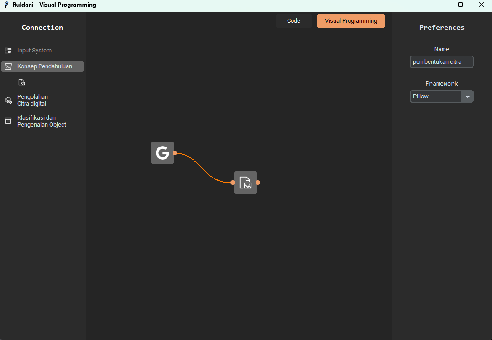
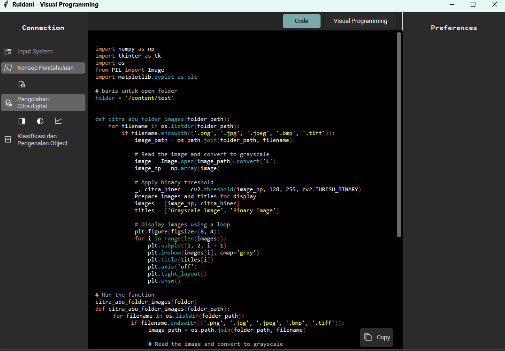

# Ruldani_VisualProgramming
 Project pembuatan library python yang bertujuan untuk pengembangan teknologi visual programming 

---

## 🎯 Our Mission
*   ✅ **Fast learning and development:** Mempercepat pembelajaran dan pengembangan project
*   ✅ **Keep it simple:** Mudah dibaca, pengabangan berbasis node
*   ✅ **Diagramize algoritm:** Ibarat gambar mampu menjelaskan 1000 kata, diagram mampu mentranspile 1000 baris code ( canda ygy 🎃)
*   ✅ **Translate it on anything:** Mentranspile diagram ke dalam banyak bahasa atau framework

## Roadmap
* [x] Visual programming core build
* [ ] Penambahan jenis - jenis parameter 
* [ ] Penambahan fitur untuk import code external
* [ ] Migrasi ke PyQt
* [ ] Optimalisasi code backend dengan golang
* [ ] Mengalahkan raja golang, ahmad
* [ ] Transpile ke Bahasa pemograman lain

## Urgent Project
Modularisasi class
berikan pada interpreter class pada class button

Tambahkan variant input dan output node
Tambakan 2 atau lebih input dan output pada draggable class
Beri warna pada Berzier Curve untuk menandai variant node

Modularisasi update preference
